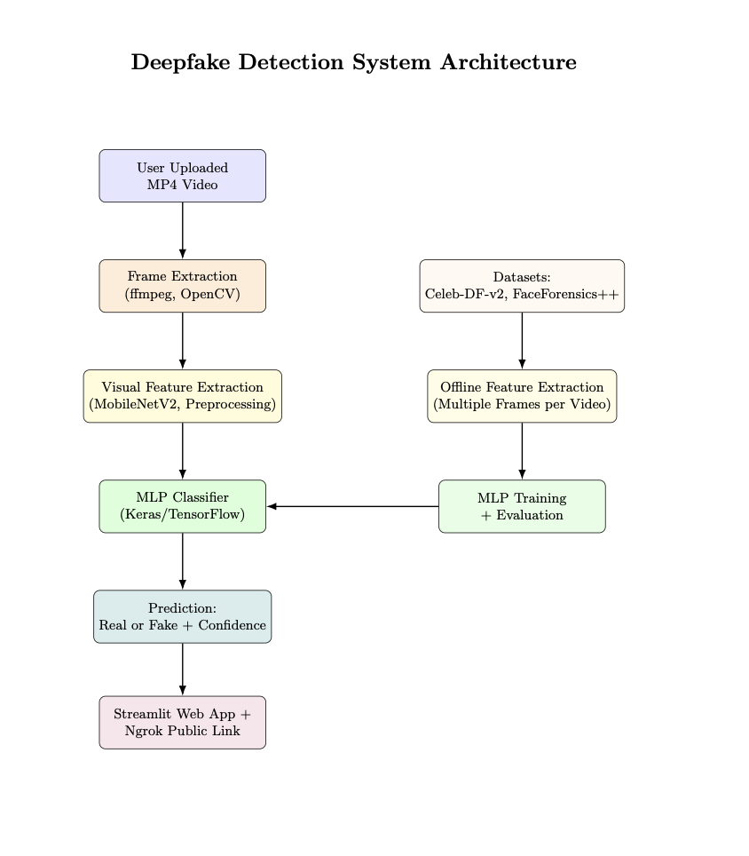

# DeepFake Detection in Online Social Network (OSN) Using Advanced Machine Learning

This project is a full-stack web application designed to detect deepfakes in videos using deep learning techniques. It enables users to upload a video and receive real-time classification results, identifying whether the content is real or fake.

## Key Features

- DeepFake Video Detection: Binary classification (Real vs Fake) using extracted visual features from MobileNetV2.
- Real-Time Video Processing: Extracts and processes frames directly from uploaded videos.
- Streamlit Interface: Simple, interactive web UI for inference.
- Public Sharing: Deployed using Ngrok for public access.
- Offline Preprocessing and Training: Uses benchmark datasets and a full preprocessing pipeline.
- Visual Feedback: Displays confidence score and selected frames.

## How It Works

The system follows a modular pipeline:

1. Data Acquisition:
   - Celeb-DF-v2 and FaceForensics++ datasets are used.
   - Data is downloaded and organized into class-wise directories.

2. Preprocessing:
   - Videos are processed using ffmpeg at 3 frames per second.
   - Between 10 to 20 random frames are selected per video.

3. Feature Extraction:
   - A pre-trained MobileNetV2 model is used to extract 1280-dimensional feature vectors.
   - Features from 5 frames are averaged to form a single vector per video.

4. Model Architecture:
   - A Multi-Layer Perceptron (MLP) is constructed using Keras.
   - It includes Dense, BatchNormalization, Dropout layers, and a final Sigmoid output layer.
   - The model is trained using Adam optimizer with binary crossentropy and early stopping.

5. Deployment:
   - The frontend is built with Streamlit to handle video upload and display predictions.
   - Frames are extracted in real-time using OpenCV.
   - Predictions are returned instantly, along with confidence scores.
   - The app is made publicly accessible using Pyngrok.

## Visual Overview

### Project Working Demo

### System Architecture

## Tech Stack

- Data Processing: Python, FFmpeg, OpenCV
- Deep Learning: TensorFlow, Keras, MobileNetV2
- Web Application: Streamlit, Pyngrok
- Environment Management: Google Colab or local virtual environment
- Visualization: Matplotlib, Seaborn